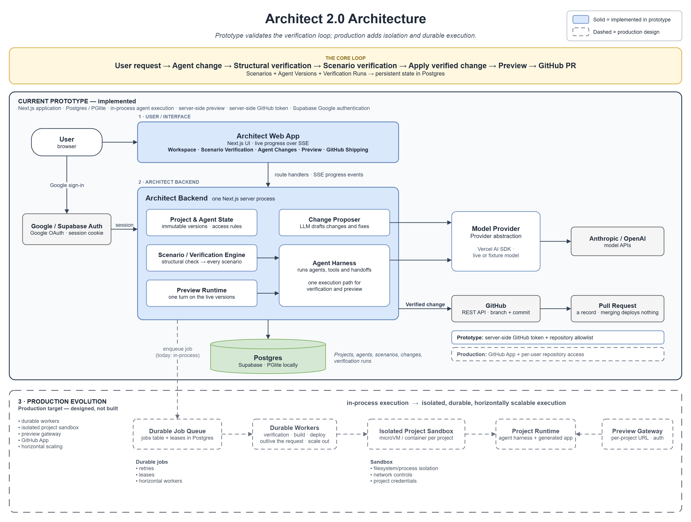

# Architect 2.0: architecture

Architect turns user intent into persistent **Scenarios** and verifies every **Change** to the agent system against
them before it can go live, and before it can ship.

```
request → Change (new immutable AgentVersions) → structural check → behavioral run (every scenario)
        → blocked: Keep the rule → Fix it   |   Change the rule → new Scenario version, re-verify
        → verified → apply (live) → scenarios re-run on the live agents → Ship to GitHub (pull request)
```

One Next.js app (App Router): route handlers for actions, Server-Sent Events for live progress, Postgres (Supabase,
or in-process PGlite locally) through Drizzle. Agents run on the Vercel AI SDK. Details of each part live in `CLAUDE.md`.

## Diagram



Source: `architecture/architect-2-architecture.drawio` (also exported as `.pdf`). Solid boxes are the prototype;
dashed boxes are the production design described below, none of which is built. The diagram names the production
pieces at whiteboard level: "Durable Job Queue" is the jobs table with leases, "Durable Workers" is the worker layer
that covers verification, build and deployment, and "Project Runtime" is the agent harness plus the generated
application inside the sandbox.
"Model Provider" is a module in the server process (`src/runtime/models.ts`), not a separate service.

## Running it: local and production

One Drizzle schema, two engines. Without `DATABASE_URL` Architect opens an in-process PGlite database, fresh per
process: zero-setup local development and the offline demo. With `DATABASE_URL` it opens Postgres (Supabase) over
`postgres.js` with prepared statements disabled, which is what the transaction pooler requires. The same
migrations in `drizzle/` apply to both, and no SQL is engine-specific — the difference is confined to
`src/db/client.ts`.

Configuration is read in one place (`src/server/env.ts`) and is server-side only: no variable is prefixed
`NEXT_PUBLIC_`, and the browser is given derived statuses (which mode, which model name, which repositories),
never a credential. `src/server/config.ts` turns that configuration into one report, which both `/api/health` and
the workspace's Environment panel render. Modes are explicit on purpose: a live mode without a usable key is
reported as a problem and refuses the work, rather than quietly falling back to the recorded fixtures — a reviewer
has to be able to tell a real result from a replayed one.

`docs/DEPLOYMENT.md` has the setup steps, the variables, and the prototype limitations that follow from this
shape — chiefly that job serialization lives in one process's memory and that background verification runs inside
an `after()` callback bounded by the route's time limit. Both are sound for a single server and neither is
pretended to be more: the production evolution is a lease row in Postgres and a durable worker, and the code that
would change is `src/server/context.ts` alone.

## Preview: running the generated application

A project in Architect is already executable. Its agents are rows (`agent_versions.config` holds instructions,
model, tools and output schema), and `src/runtime/run-system.ts` runs them against a message. So "preview the
generated app" needs a surface, not a deployment.

### Prototype (implemented)

```
Browser ──▶ /preview/<projectId> ──▶ POST /api/preview ──▶ runSystem(live agent versions) ──▶ provider
```

- The preview page is a separate URL per project and opens in its own tab, so the generated application is a
  thing you can visit, not a panel inside Architect.
- One turn is **one `runSystem` call on the project's live agent versions** — the same function, tool registry and
  models the verification engine uses. There is no preview-only execution path, so the preview cannot drift from
  what the scenarios check.
- Each turn re-reads the live versions, so applying a change in Architect changes the next answer. The agent
  lineup in the preview header carries version numbers, which is how you see that it landed.
- Nothing is written. A preview turn creates no `runs` row and emits no event: it is interaction, not
  verification, and the run history is the record of what was verified.
- The trace is one click under every answer — which agents ran, what they called, what each returned. A preview
  you cannot check is a demo.

What it is not: there is no sandbox, no process isolation, no generated code and no deployment. The agents run
in the Architect server process, on the server's provider credential. That is honest for a single-tenant
prototype where every project is the owner's own, and it is exactly what the production design below replaces.

### Production

```
Browser ──▶ preview gateway ──(signed, scoped session)──▶ sandbox ──▶ agent harness ──▶ generated application
                   │                                        │
                   └── per-project hostname, rate limits     └── per-project credentials, egress allowlist
```

- **Preview gateway/proxy.** A per-project hostname (`<project>.preview.<domain>`) terminating at a gateway that
  authenticates the viewer, rate-limits, and routes to that project's sandbox. It is also the only thing that
  needs to be public, so the sandbox never is.
- **Isolated sandbox.** One short-lived, per-project execution environment (Firecracker microVM or an equivalent
  container sandbox) with no ambient credentials, a filesystem it cannot escape, and an **egress allowlist** —
  the model provider and the project's declared tool endpoints, nothing else. This is what makes it safe to run
  tools a user's project defines rather than only the ones Architect ships.
- **Agent harness.** The runtime that exists today (`runSystem`, the tool registry, the fixture model) packaged
  as the sandbox's entrypoint, taking an agent system as data and exposing one `POST /turn`. Keeping it the same
  code is the point: the preview, the scenarios and production would stay one execution path.
- **Generated application.** Today a project is agents plus data. If projects later carry their own UI or custom
  tool implementations, that artifact is built and served inside the sandbox, which is also where arbitrary
  generated code would first become safe to execute.
- **Deployment.** Promoting a verified change from preview to a durable environment, reusing the existing ship
  gate: a project only deploys from a change that is applied, structurally valid and passing every scenario.
- **Credentials.** The sandbox gets a short-lived, per-project token from the gateway, never the server's
  provider key — the same reasoning as the GitHub App installation token below.

None of the production row is built. The prototype runs the generated project in the Architect server process,
and the only reason that is acceptable is that generated projects have no tools and no generated code to execute.

## Shipping to GitHub

**Invariant: a Change cannot be shipped until Architect has verified its behavior.** The server enforces this in
`src/shipping/gate.ts` for every ship request; the UI only reflects the same gate. A change ships only when:

- it is **applied**, with passing structural verification and a passing behavioral run on record;
- the live agents are exactly the version set that run verified (a later change hasn't replaced them);
- scenarios have re-run on the live agents since it was applied, and **every current scenario version passes** there
  (so no failed scenario, including a rule changed after the fact, is left unresolved).

Shipping (`src/shipping/ship.ts`) then makes branch `architect/change-<change-id>` from the repository's default
branch, one commit, and a pull request whose body states the verification result. Provenance (repository, branch,
commit SHA, PR number and URL, timestamps, the verifying run) is stored in `change_shipments`, one row per change.
That row is also the claim that makes shipping idempotent: a double click can't open two PRs, a shipped change
returns its recorded PR, and a retry after a failure reuses the branch, skips an identical commit and reuses an
existing PR. Failures are recorded as `change.ship_failed` events.

**What the commit contains (prototype representation).** Architect doesn't generate application code yet, so it
doesn't pretend to: the commit is the verified agent system itself, as machine-readable files under `architect/`:
each agent's live AgentVersion, the scenarios it was verified against, and a record of the change and its
verification runs. The PR and the UI both say so.

### Prototype

```
Browser ──(ship request, no credentials)──▶ Next.js server ──(server-side token)──▶ GitHub REST API ──▶ repository
```

- One server-side credential from the environment: `ARCHITECT_GITHUB_TOKEN`, a fine-grained token limited to the
  repositories in `ARCHITECT_GITHUB_REPOS` (Contents and Pull requests: read and write). The user picks a
  repository from that allowlist; the server rejects anything else.
- All GitHub calls go through one narrow provider (`src/github/provider.ts`: get repository, get/create branch,
  commit files, find/create pull request) over `fetch`. Nothing else in the codebase talks to GitHub.

### Production

```
Browser ──▶ Next.js server ──(App private key → JWT)──▶ GitHub App ──▶ short-lived installation token ──▶ repository
```

- Users install an Architect **GitHub App** on the repositories they choose. That installation, not a pasted token,
  is the "connect a repository" step, and it defines what Architect can reach.
- For each ship, the server signs a JWT with the App's private key and exchanges it for an **installation access
  token**: it expires after an hour and is restricted to that installation's repositories and the App's
  permissions (Contents, Pull requests). Nothing long-lived ever reaches a user's machine.
- The provider already takes a token supplier, so this replaces the environment token without changing the
  shipping flow.

### Why the credential is server-side and scoped

- **It never leaves the server.** It isn't sent to the browser (the workspace only learns whether GitHub is
  configured and which repositories are allowed), and it isn't in agent prompts, the scenario runtime, events,
  stored provenance or committed files. Agents never get a GitHub tool.
- **It is opt-in and narrow.** Architect-prefixed variables avoid picking up an ambient `GITHUB_TOKEN` by accident;
  the token is limited to specific repositories and two permissions, and shipping only opens a pull request. It
  never pushes to the default branch, so a human still reviews and merges.
- **Short-lived in production.** Installation tokens expire within the hour and are scoped per installation, so a
  leak is bounded in time and reach.

## Deployment: what happens after a change is applied

### Prototype (implemented)

There is no deployment step, and the product says so rather than miming one.

```
verified change ──▶ apply ──▶ live immediately ──▶ /preview/<projectId>
                      │
                      └──▶ ship ──▶ pull request (a record, not a release)
```

- **Applying is the release.** An agent's `currentVersionId` moves, and the next request — a scenario run or a
  preview turn — loads the new version. No build, no artifact, no restart.
- **Architect is the runtime.** One Next.js deployment plus Supabase runs every project's agents, on the server's
  own model credential. The "live URL" of a project is `<ARCHITECT_PUBLIC_URL>/preview/<projectId>` on that same
  deployment; it is not a per-project host.
- **Shipping is provenance, not deployment.** The pull request commits the verified agent and scenario definitions
  and the change's verification record, and links back to both the change in Architect and the running system.
  Merging it deploys nothing. The workspace's "Live result" step states this in those words.
- The gate still means what it says: a change only reaches GitHub after structural verification passed, its
  scenarios passed, it was applied, and the live agents re-passed every current rule.

### Production

```
verified change ──▶ deploy queue ──▶ build worker ──▶ artifact registry
                                          │
                                          ▼
                     deployment worker (lease) ──▶ sandbox ──▶ preview gateway ──▶ environment
```

- **Queue and leases.** "Deploy this change" becomes a row in a jobs table, claimed by a worker with a conditional
  `update ... where expires_at < now()`, renewed while it works and expiring if the instance dies. That same
  mechanism replaces the process-local one-job lock Architect uses today (`src/server/context.ts`), which is the
  one piece of state that stops this prototype running on more than one instance.
- **Isolated builds.** A build worker turns the verified project into an immutable, content-addressed artifact in a
  sandbox with no credentials and no network beyond its package source. Builds are the first place generated code
  could exist, so they are the first place isolation is non-optional.
- **Deployment workers and environments.** A deployment worker places an artifact into a per-project sandbox and
  flips the gateway's route when it is healthy, so a bad version never takes traffic. Promotion from preview to a
  durable environment reuses the existing ship gate: only an applied, structurally valid, fully passing change is
  eligible.
- **Credentials.** No shared server key. Each sandbox receives a short-lived, per-project token from the gateway;
  GitHub access comes from a GitHub App installation token (below), not a pasted PAT.
- **Scaling.** The web tier is already stateless apart from that lock, so it scales horizontally once the lease
  moves to Postgres. Workers scale independently of request traffic, and SSE-over-polling (`/api/events`) becomes a
  real pub/sub channel. `docs/DEPLOYMENT.md` §8 lists the prototype limits this removes, one by one.

None of the production row is built. What exists is the left-hand side: verify, apply, run, and record.
